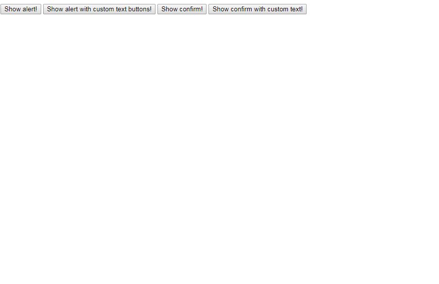

# vanilla-dialogs

[](https://travis-ci.org/thiamsantos/vanilla-dialogs)
[](https://www.npmjs.com/package/vanilla-dialogs)

> Promise-based confirm, alert and prompt dialogs



## Table of Contents

- [Install](#install)
- [Usage](#usage)
- [License](#license)

## Install

This project uses [node](http://nodejs.org) and [npm](https://npmjs.com).
Go check them out if you don't have them locally installed.

```sh
$ npm install --save vanilla-dialogs
```

## Usage

```js
import {alert, confirm, prompt} from 'vanilla-dialogs'

alert('Lorem ipsum dolor sit amet.').then(() => {
  console.log('closed')
})

alert('Vestibulum commodo nunc a mauris interdum.', {
    confirmText: 'Wow'
  }).then(() => {
  console.log('closed')
})

confirm('Donec quis leo vitae sem placerat sagittis.').then(result => {
  console.log('result:', result)
})

confirm('Morbi elementum ex vestibulum porttitor sodales.', {
  cancelText: 'Close',
  confirmText: 'Wow'
}).then(result => {
  console.log('result:', result)
})

prompt('Donec quis leo vitae sem placerat sagittis?').then(result => {
  console.log('result:', result)
})

prompt('Donec quis leo vitae sem placerat sagittis?', {
  regex: /\d$/g
}).then(result => {
  console.log('result:', result)
})

prompt('Donec quis leo vitae sem placerat sagittis?', {
  cancelText: 'Wtf?',
  confirmText: 'Send'
}).then(result => {
  console.log('result:', result)
})

prompt('Donec quis leo vitae sem placerat sagittis?', {
  defaultValue: 'Hey man'
}).then(result => {
  console.log('result:', result)
})
```

## License

[MIT License](LICENSE) © [Thiago Santos](https://thiamsantos.github.io/)
